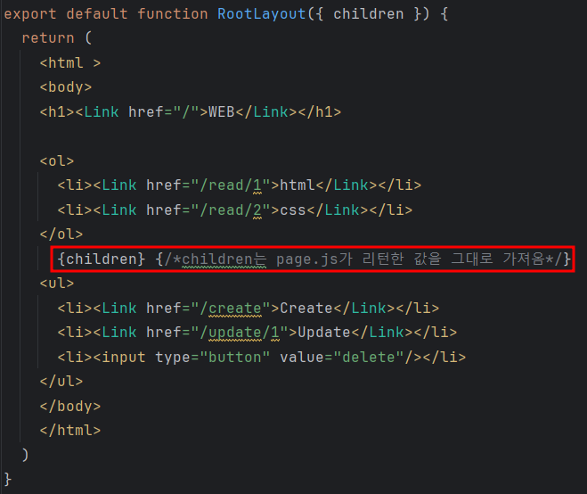
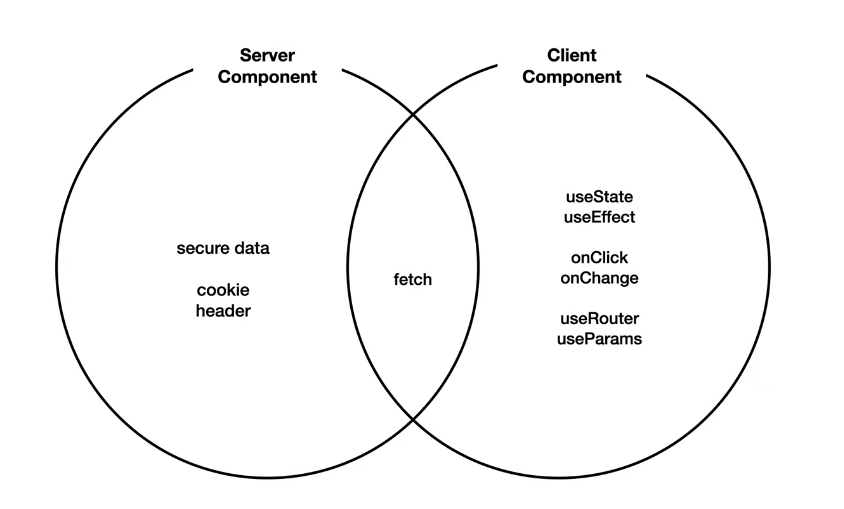
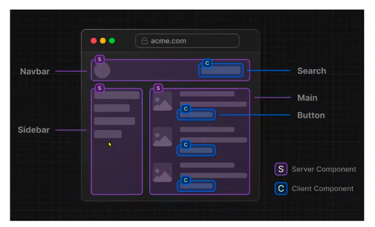

```angular2html
fetch(http://localhost:9999/topics)
      .then((res)=>{return res.json();})
      .then(result=>{console.log('result:', result);});
```


<br>
<br>

환경변수화는 기본적으로 서버 컴포넌트에서만 작동
클라이언트 컴포넌트는 유저와의 상호작용이 일어나기 때문에 중요한 정보를 담기엔 위험성이 큼


서버 실행: `npx json-server --port 9999 --watch db.json`
클라이언트 실행: `next dev`

영상: https://www.youtube.com/playlist?list=PLuHgQVnccGMCwxXsQuEoG-JJ7RlwtNdwJ